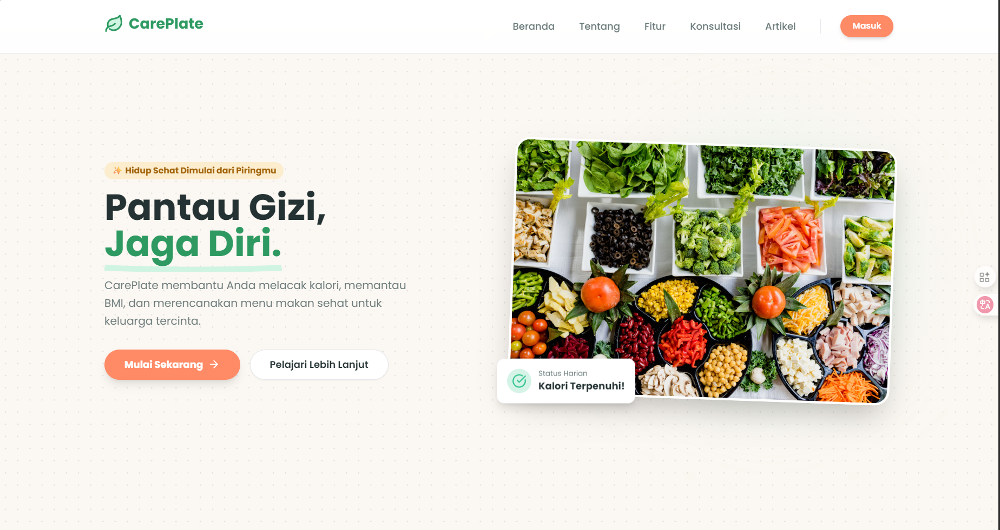
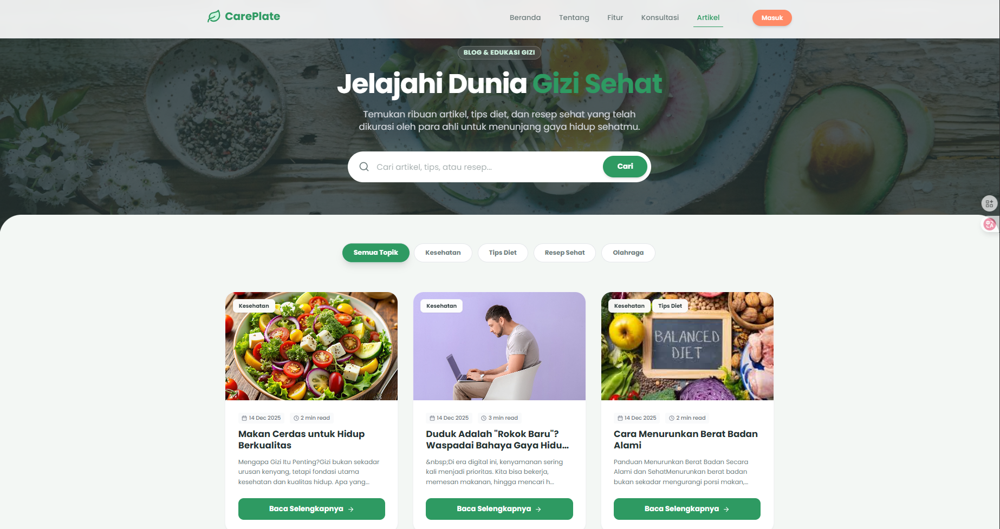
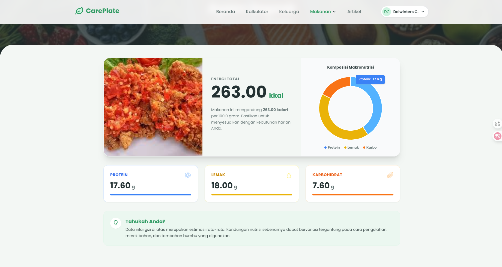
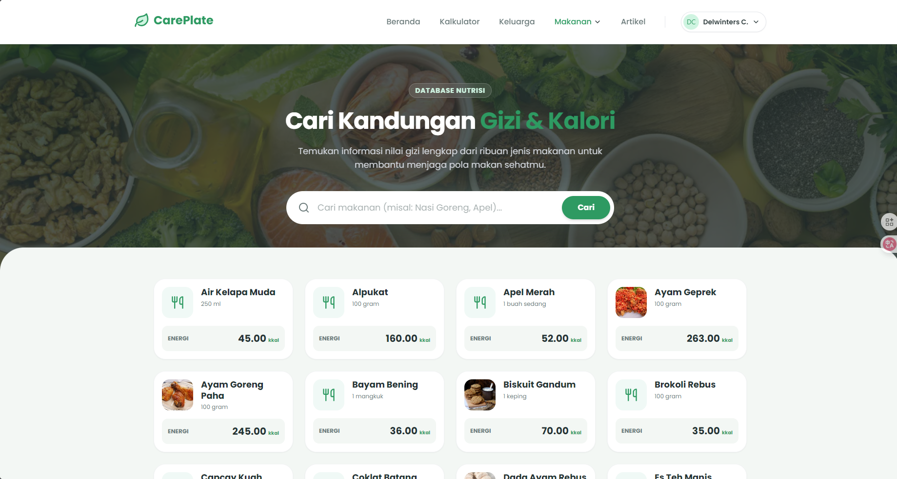
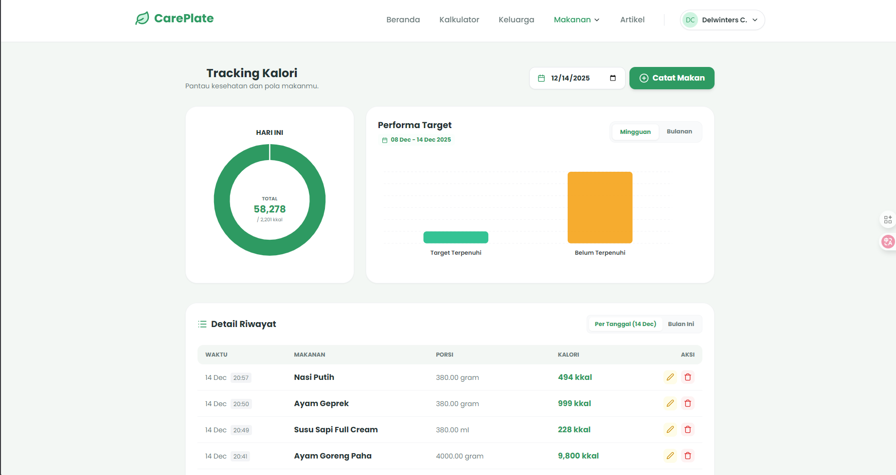

# CarePlate 🥗✨

<div align="center">
  <a href="https://careplate.tunggulmajid.my.id/" target="_blank">
    
  </a>
  
  <br/>
  <br/>

  <a href="https://github.com/delissesu/Website-perGizian/stargazers">
    
  </a>
  <a href="https://github.com/delissesu/Website-perGizian/forks">
    
  </a>
  <a href="https://github.com/delissesu/Website-perGizian/graphs/contributors">
    
  </a>

  <br/>
  <br/>

  <h1><b>"Hidup sehat dimulai dari piringmu."</b></h1>
  
  <p style="font-size: 1.2em; max-width: 600px; margin: 0 auto;">
    <b>CarePlate</b> adalah asisten gizi pribadi cerdas yang membantu Anda dan keluarga tercinta mencapai gaya hidup sehat.
    <br/>
    Dilengkapi fitur pelacakan kalori otomatis, pemantauan BMI, dan konsultasi ahli gizi terpercaya.
  </p>

  <br/>

  <a href="https://careplate.tunggulmajid.my.id/">
    
  </a>
</div>

---

## 📑 Daftar Isi (Table of Contents)

- [🚀 Fitur Unggulan](#-fitur-unggulan)
- [📸 Galeri Aplikasi](#-galeri-aplikasi)
- [🛠️ Tech Ingredients](#️-tech-ingredients)
- [💻 Instalasi & Setup](#-instalasi--setup)
- [👥 Kontributor](#-head-chefs-contributors)

---

## 🚀 Fitur Unggulan

| Fitur | Deskripsi |
| :--- | :--- |
| **📊 Smart Dashboard** | Pantau progres kesehatan, BMI, dan asupan kalori secara *real-time*. |
| **🍎 Food Tracking** | Database makanan lengkap untuk mencatat sarapan, makan siang, dan makan malam. |
| **👨‍👩‍👧‍👦 Family Management** | Kelola gizi seluruh anggota keluarga dalam satu akun terintegrasi. |
| **💬 Konsultasi Ahli** | Terhubung langsung dengan ahli gizi terverifikasi via WhatsApp. |
| **📱 Responsif** | Tampilan UI/UX premium yang nyaman digunakan di HP maupun Desktop. |

---

## 📸 Galeri Aplikasi

<div align="center">
  <table>
    <tr>
      <td align="center" width="50%">
        
        <br/><b>Artikel Kesehatan</b>
      </td>
      <td align="center" width="50%">
         
        <br/><b>Informasi Gizi</b>
      </td>
    </tr>
     <tr>
      <td align="center" width="50%">
        
        <br/><b>Pencarian Kalori</b>
      </td>
      <td align="center" width="50%">
         
        <br/><b>Tracking Kalori</b>
      </td>
    </tr>
  </table>
</div>

---

## 🛠️ Tech Ingredients

Kami membuat website ini menggunakan teknologi modern agar performanya satset T_T

<div align="center">

  
  
  
  
  
  

  <br/>

  
  
  

</div>

### 📦 Special Seasoning (Packages)
* 🔐 **Auth:** `laravel/breeze` & `laravel/socialite`
* 🛡️ **Security:** `spatie/laravel-permission`
* 📈 **Charts:** `apexcharts`

---

## 💻 Instalasi & Setup

Ikuti langkah-langkah berikut untuk menjalankan "Care Plate" kami di lokal kalian!

### Prasyarat
* PHP >= 8.2
* Composer
* Node.js & NPM

### Langkah Memasak (Installation Steps)

<details>
<summary><b>🍳 Klik untuk melihat panduan instalasi lengkap</b></summary>
<br/>

1.  **Clone Repository**
    ```bash
    git clone https://github.com/delissesu/Website-perGizian.git
    cd Website-perGizian
    ```

2.  **Install Dependencies (Backend)**
    ```bash
    composer install
    ```

3.  **Install Dependencies (Frontend)**
    ```bash
    npm install
    ```

4.  **Konfigurasi Environment**
    Salin file `.env.example` menjadi `.env`:
    ```bash
    cp .env.example .env
    ```
    *Buka file `.env` dan atur konfigurasi database jika diperlukan.*

5.  **Generate App Key**
    ```bash
    php artisan key:generate
    ```

6.  **Migrasi Database**
    ```bash
    php artisan migrate --seed
    ```

7.  **Sajikan (Run Server)**
    Buka dua terminal terpisah:
    ```bash
    # Terminal 1
    php artisan serve
    ```
    ```bash
    # Terminal 2
    npm run dev
    ```

8.  **Selamat Makan!**
    Buka browser dan akses `http://localhost:8000`.

</details>

---

## 👨‍🍳 Head Chefs (Contributors)

Project ini dimasak dengan beberapa sosok deadliner ini:

<table>
  <tr>
    <td align="center">
      <a href="https://github.com/delissesu">
        
        <br />
        <sub><b>Deliwinters</b></sub>
      </a>
    </td>
    <td align="center">
      <a href="https://github.com/farhanzsani">
        
        <br />
        <sub><b>Farhan</b></sub>
      </a>
    </td>
    <td align="center">
      <a href="https://github.com/tunggulalmajid">
        
        <br />
        <sub><b>Tunggul</b></sub>
      </a>
    </td>
  </tr>
</table>

---

<div align="center">
  <br/>
  
  Made by **Tim Mas Richie Mas Richie, Kami Pengen Juara Techcomfest**. 🔥
</div>